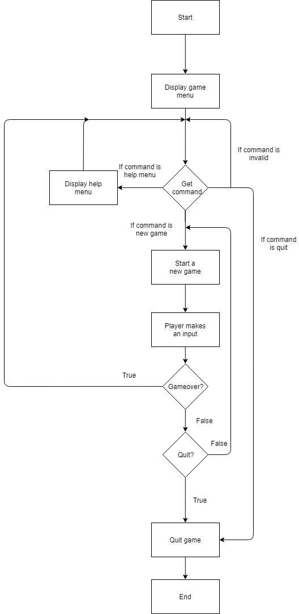
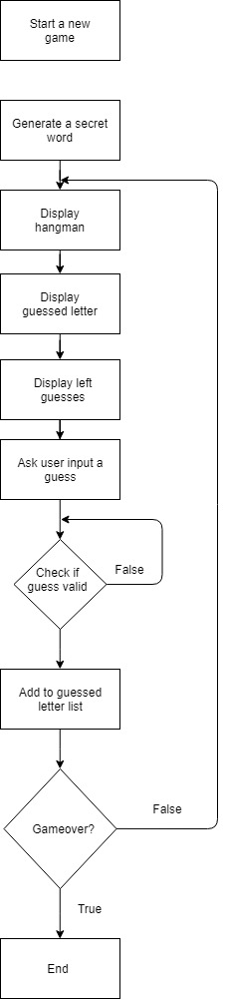

# README
Gen tech terminal app

* Github repository link
https://github.com/kkk987/Hangman.git

# App Description:
 * Purpose:
    
    This is a hangman game app. Player can guess a secrect word from terminal. The more wrong guesses the more pieces of hangman will be drawn.
 * Functionality:
    
    This app currently enables to do the followings:
      * Display the hangman game menu
      * Generate a random secret word 
      * Player can guess the secret with limited guesses
      * User input validation
      * Hangman drawing
      * Display help menu
      * Start a new game
      * Quit game
* Instruction for use:
  
    ruby hangman.rb

* Future enhancements:
    
    * Disclaim page
    * Save/load a game
    * Game settings(such as font, font size, color etcs)
    * Leader board
    * Sound while playing hangman
    * Human VS human mode

* Accessibility concerns:

* Potential legal, moral, ethical, cultural and safety issues:

    Young players may experience uncomfortableness towards the hangman drawings. And some of the secret words may be offensive to certain group of people.
    As a solution, a disclaim page will be added as a future enhancement. And possible offensive words will be reassessed before adding into word list.
* Possible social, political, cultural, racial, gender and international issues:
    Some of the secret words may be offensive to certain social, political, cultural, racial, gender and international groups. These words will be assessed before adding into world lists.
# Design and Planning:
* Evidence of app idea brainstorming sessions:
    
    Hangman game is the topic of this terminal app. The reasons to pick hangman are that:
    - a good opportunity to practise the input validation
    -  learn how to use class and module
    -  learn how to write dry codes
    -  and plenty of advanced features for future developemnt

* User stories:

    - US -1: As a user, I can guess a word
    - US - 2: As a user, I can see the chances left
    - US - 3: As a user, I know what letters I guessed
    - US - 4: As a user, I know which letter I guessed is correct
    - US - 5: As a user, I can restart the game when I finish one
  
* Project plan and timeline:

- 
- 
  
* Description of overall app design (classes, files, basic flow):

    hangman: This is the main file where runs all related programs. 

    Class - game: The game class is the framwork of the whole game. This class responses to basic game machanisim such as display menu and corresponding reactions, initialize other classes, check gameover status and quit game.
    
    Class - player: The player class stores all user information and behaviors. At this stage, there are not much attributes and behaviors are stored in this class. But it will provide extra flexibility when consideirng future developments which involves players such as leader board or save/load a game

    Module - Word list: The word list module stores methods that are related with word processing such as generate a secret. This is listed as a separated file for the same reason as player class's which provides more flexibility for future features.

    Module - Hangman lib: This file contains some commonly called methods which are eaiser for maintainence and debugging purposes.

    Module -  Hangman art: This file contains the ascii art of hangman. This file is supposed to be part of game class, however it will make a single class file too big. And consideirng some future features like difficulty setting (each difficulty has a different guesses at start), it is separated as an individual file.

    Class - Hangman test: This file includes all testing for main program. It is separated so that it is more editable and readable for programmer.

    Yaml file - Word list: This is the default word list where provides a list of secret words for players to guess.

    Flowchart:
    - 
    - 

* Design considerations and choices:
    
    There are a couple of choices when first design hangman game. One of the alternatives is to use a gem called "gosu" which is a gem specialising in games as the game framwork. However, a gem normally contains many other functionalities that are not necessary for the project and may increase the difficulty in debugging. Therefore the final design is to write an individual class that holds the baisc framwork of the game which is easier for debugging purpose and editing. 

* Screenshots of Trello board(s):
    - 

